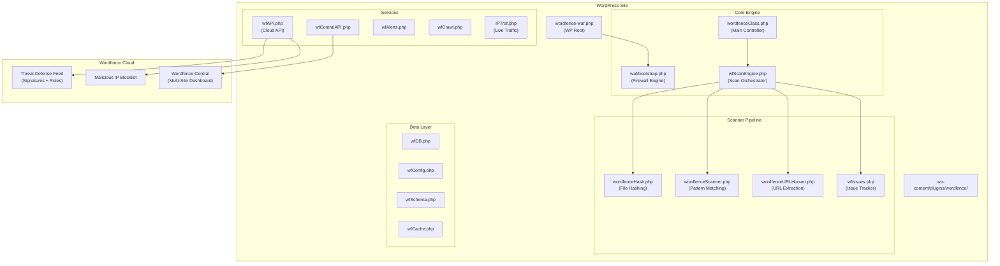
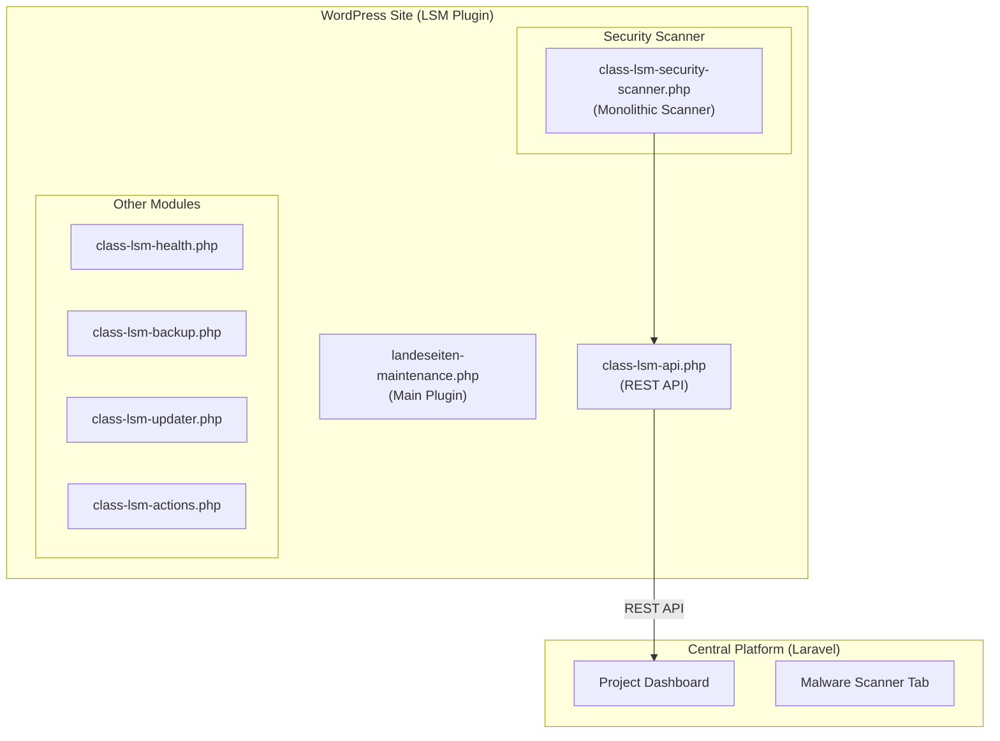

# Wordfence Deep Dive & Scanner Feature Plan

> A comprehensive analysis of Wordfence's architecture, what it does, and how to build something equivalent into the LSM platform.

---

## 1. Wordfence Complete Feature Map

Based on examining Wordfence's SVN source code (60+ PHP classes in `lib/`) and its WordPress plugin page, here is every major feature Wordfence provides:

### 🛡️ A. Web Application Firewall (WAF)

| Feature | What It Does | Free | Premium |
|---------|-------------|------|---------|
| **Endpoint Firewall** | PHP-based WAF running inside WordPress, loads via `wordfence-waf.php` in WP root. Inspects all HTTP requests before WP processes them | ✅ | ✅ |
| **Rule-Based Filtering** | Blocks SQL injection, XSS, file upload attacks, directory traversal, LFI, XXE | ✅ | ✅ |
| **Real-Time Rule Updates** | Firewall rules updated as new threats emerge | 30-day delay | ✅ Real-time |
| **IP Blocklist** | Blocks known malicious IPs across the Wordfence network | Brute-force only | ✅ Full list |
| **Rate Limiting** | Throttles aggressive crawlers, bots, humans per time period | ✅ | ✅ |
| **Country Blocking** | Block access from specific countries | ❌ | ✅ |
| **Learning Mode** | Auto-learns legitimate traffic to reduce false positives | ✅ | ✅ |
| **Brute Force Protection** | Locks out after failed login attempts, blocks invalid usernames | ✅ | ✅ |

**Key Source Files:**
- `waf/bootstrap.php` — WAF initialization
- `waf/wfWAFIPBlocksController.php` — IP blocking logic
- `waf/wfWAFUserIPRange.php` — IP range management
- `lib/wfConfig.php` — Configuration management

---

### 🔍 B. Malware Scanner

| Feature | What It Does | Free | Premium |
|---------|-------------|------|---------|
| **Core File Integrity** | Compares WP core files against official checksums from wordpress.org API | ✅ | ✅ |
| **Plugin/Theme Integrity** | Compares plugin/theme files against wordpress.org repository versions | ✅ | ✅ |
| **Malware Signature Matching** | 44,000+ known malware signatures scanned against all PHP files | 30-day delay | ✅ Real-time |
| **Backdoor Detection** | Specific patterns for known backdoors (eval, base64, shell functions) | ✅ | ✅ |
| **SEO Spam Detection** | Finds spam injected in posts, comments, files | ✅ | ✅ |
| **URL Content Scanning** | Scans post/comment content for malicious URLs | ✅ | ✅ |
| **File Change Detection** | Alerts when files are modified unexpectedly | ✅ | ✅ |
| **Suspicious File Detection** | Finds PHP in uploads, double extensions, hidden files | ✅ | ✅ |
| **High Sensitivity Mode** | Treats images/binary files as executable code for deep inspection | ✅ | ✅ |
| **Database Scanning** | Full DB scan for malicious content (CLI v5.0.1, Nov 2024) | ✅ | ✅ |
| **One-Click Repair** | Replace compromised core/plugin/theme files with originals from WP.org | ✅ | ✅ |
| **Scheduled Scans** | Auto runs: Quick daily (free), Full every 72h (free) / 24h (premium) | ✅ | ✅ Custom schedules |

**Key Source Files:**
- `lib/wfScanEngine.php` — Core scan orchestration
- `lib/wfScan.php` — Scan lifecycle management
- `lib/wfScanEntrypoint.php` — Scan entry/exit
- `lib/wfScanFile.php` — Individual file scanning
- `lib/wfScanFileProperties.php` — File metadata
- `lib/wfScanMonitor.php` — Scan progress tracking
- `lib/wfScanPath.php` — Path management
- `lib/wordfenceScanner.php` — Scanner class
- `lib/wordfenceHash.php` — File hashing/comparison
- `lib/wordfenceURLHoover.php` — URL extraction/checking
- `lib/wfIssues.php` — Issue tracking/management
- `lib/Diff.php` + `lib/diffResult.php` — File diff generation

**Scan Types:**

```
Quick Scan → Core checks only (fast)
Standard Scan → Core + plugins + themes + common malware patterns
Full Scan → Everything including deep content inspection
High Sensitivity → Includes binary/image inspection, more aggressive patterns
Custom Scan → User-configurable modules
```

---

### 🔐 C. Login Security

| Feature | What It Does | Free | Premium |
|---------|-------------|------|---------|
| **2FA (TOTP)** | Time-based OTP via authenticator apps (Google Auth, Authy) | ✅ | ✅ |
| **Login Page CAPTCHA** | reCAPTCHA on wp-login.php | ✅ | ✅ |
| **Brute Force Protection** | Lockout after N failed attempts | ✅ | ✅ |
| **Invalid Username Lockout** | Immediately block login attempts with non-existent usernames | ✅ | ✅ |
| **Password Strength** | Enforce strong passwords, check against breached password lists | ✅ | ✅ |
| **XML-RPC Protection** | Disable or add 2FA to XML-RPC | ✅ | ✅ |

**Key Source Files:**
- `modules/login-security/` — Entire login security module
- `lib/wfCommonPasswords.php` — Breached password database

---

### 📊 D. Monitoring & Intelligence

| Feature | What It Does | Free | Premium |
|---------|-------------|------|---------|
| **Live Traffic** | Real-time view of all requests: IPs, paths, user agents, response codes | ✅ | ✅ |
| **Audit Log** | Security-sensitive event recording (logins, config changes, file changes) | ❌ | ✅ |
| **GeoIP Lookup** | Map IPs to countries using MaxMind database | ✅ | ✅ |
| **WHOIS Lookup** | IP/domain WHOIS information | ✅ | ✅ |
| **Reputation Checks** | Check if site/IP is on blocklists (Spamhaus, Google Safe Browsing, etc.) | ❌ | ✅ |
| **Vulnerability Alerts** | Monitors for known CVEs in installed plugins/themes/core | ✅ | ✅ |

**Key Source Files:**
- `lib/IPTraf.php` + `IPTrafList.php` — Live traffic tracking
- `lib/live_activity.php` — Real-time activity dashboard
- `lib/geoip.mmdb` — MaxMind GeoIP database
- `lib/audit-log/` — Audit log module
- `lib/wfAuditLog.php` — Audit log class
- `lib/wfBrowscap.php` — Browser/bot identification
- `lib/wfCrawl.php` — Crawl/bot detection
- `lib/wfActivityReport.php` — Weekly activity email reports

---

### 🌐 E. Central Management & API

| Feature | What It Does | Free | Premium |
|---------|-------------|------|---------|
| **Wordfence Central** | Manage multiple sites from one dashboard | ✅ | ✅ |
| **Remote Scan Trigger** | Start scans remotely | ✅ | ✅ |
| **Config Templates** | Apply same security config across all sites | ✅ | ✅ |
| **Vulnerability Overview** | See vuln status of all sites at once | ✅ | ✅ |
| **Threat Defense Feed** | Cloud-based signature/rule distribution | ✅ (delayed) | ✅ (real-time) |
| **Import/Export Settings** | Transfer Wordfence config between sites | ✅ | ✅ |

**Key Source Files:**
- `lib/wfCentralAPI.php` — Central API communication
- `lib/wfRESTAPI.php` — REST API endpoints
- `lib/rest-api/` — REST API classes
- `lib/wfImportExportController.php` — Settings portability
- `lib/wfAPI.php` — Wordfence cloud API

---

### 🔔 F. Notifications & Reporting

| Feature | What It Does |
|---------|-------------|
| **Email Alerts** | Configurable alerts for scan results, lockouts, blocked attacks |
| **Admin Notices** | WordPress dashboard notifications for critical issues |
| **Activity Reports** | Weekly email summary of security events |
| **Scan Result Emails** | Automated email when scan finds issues |

**Key Source Files:**
- `lib/email_genericAlert.php` — Generic alert template
- `lib/email_newIssues.php` — New scan issues notification
- `lib/email_unlockRequest.php` — Account unlock email
- `lib/wfAlerts.php` — Alert management
- `lib/wfNotification.php` — Notification system
- `lib/wfAdminNoticeQueue.php` — Admin notice queuing

---

## 2. What We Already Have (LSM Security Scanner)

Our current [class-lsm-security-scanner.php](file:///Users/bmarkovic/Documents/Projects/MaliciousAudit/lsm-wp-improvements/landeseiten-maintenance/includes/class-lsm-security-scanner.php) has **2,184 lines** with **40 methods** organized into these modules:

### ✅ Currently Implemented

| Module | Methods | Coverage |
|--------|---------|----------|
| **Core Integrity** | `check_core_integrity()`, `get_core_checksums()` | Compares WP core against official checksums |
| **Malware Signatures** | `scan_malware_signatures()` | Pattern matching in `wp-content/` |
| **Suspicious Files** | `detect_suspicious_files()`, `find_php_in_images()`, `find_double_extensions()`, `find_hidden_files()`, `find_recently_modified_core_files()` | PHP in uploads, double extensions, hidden files |
| **Fake Plugins** | `detect_fake_plugins()` | Rogue plugin directory detection |
| **.htaccess Scanning** | `scan_htaccess_files()`, `find_htaccess_recursive()` | SEO cloaking, forced PHP execution, redirects |
| **Entropy Analysis** | `scan_entropy_analysis()`, `calculate_shannon_entropy()` | Obfuscated code detection via Shannon entropy |
| **Database Anomalies** | 13 sub-checks (admins, URLs, crons, widgets, spam posts, code snippets, DB persistence, options, injection, user patterns, transients) | Comprehensive DB-level malware detection |
| **Permissions Audit** | `audit_permissions()`, `check_writable_dirs()` | File/directory permission checking |
| **Scan Management** | `run()`, `is_timed_out()`, `calculate_risk_level()` | Scan orchestration with timeout handling |

### Also Available (from Security Audit Skill)

- SSH-based forensic analysis workflow
- Backup protocol before cleanup
- Browser-based live verification
- Google Safe Browsing flag resolution
- Report generation templates

---

## 3. Gap Analysis: What Wordfence Has That We Don't

### 🔴 Critical Gaps (High Impact, Should Build)

| # | Feature | Wordfence Approach | Our Gap | Effort |
|---|---------|-------------------|---------|--------|
| 1 | **Plugin/Theme Integrity Checks** | Compares every file in every plugin/theme against wordpress.org checksums | We only check WP core, not individual plugins/themes | Medium |
| 2 | **One-Click File Repair** | Downloads original from WP.org and replaces compromised file | No repair capability — we only report | Medium |
| 3 | **Signature Database Updates** | 44K+ signatures, updated in real-time via cloud API | Our signatures are hardcoded in PHP | High |
| 4 | **Scheduled/Automatic Scans** | Runs on WP cron — quick daily, full every 72h | Manual trigger only via API | Low |
| 5 | **Vulnerability Detection** | Cross-references installed plugin/theme versions against CVE database | Not implemented | Medium |
| 6 | **URL/Content Scanning** | Scans post content for malicious URLs, checks against blocklists | We check for injected scripts but not URL reputation | Medium |
| 7 | **Scan Progress Tracking** | Real-time progress visible in admin UI with percentage/step indicators | API returns result at end, no progress streaming | Medium |

### 🟡 Important Gaps (Medium Impact)

| # | Feature | Wordfence Approach | Our Gap | Effort |
|---|---------|-------------------|---------|--------|
| 8 | **Live Traffic Monitoring** | Real-time request logging with IP, path, UA, response code | Not implemented | High |
| 9 | **WAF (Web Application Firewall)** | PHP-based request filtering before WP processes | Not implemented — different architecture needed | Very High |
| 10 | **IP Blocking/Rate Limiting** | Block by IP, range, country; rate limit by requests/time | Not implemented | High |
| 11 | **2FA / Login Security** | TOTP-based 2FA, brute force protection, CAPTCHA | Not implemented | High |
| 12 | **Reputation/Blocklist Checks** | Checks site against Spamhaus, Google Safe Browsing, etc. | Not implemented | Medium |
| 13 | **WHOIS Lookup** | Built-in IP/domain WHOIS | Not in scanner (exists in platform elsewhere) | Low |
| 14 | **GeoIP Mapping** | MaxMind DB for IP geolocation | Not implemented | Low |

### 🟢 Nice-to-Have Gaps (Lower Priority)

| # | Feature | Wordfence Approach | Our Gap | Effort |
|---|---------|-------------------|---------|--------|
| 15 | **Audit Log** | Logs security events: logins, changes, updates | Not implemented | Medium |
| 16 | **File Diff Viewer** | Shows exact diff of changed files vs originals | Not implemented (we use `wp core verify-checksums` externally) | Medium |
| 17 | **Browser/Bot Identification** | Browscap DB for user agent classification | Not implemented | Low |
| 18 | **Common Password Check** | Checks passwords against breach databases | Not implemented | Low |
| 19 | **Weekly Email Reports** | Automated security summary emails | Not implemented | Low |
| 20 | **Configuration Import/Export** | Transfer settings between sites | Not applicable (centrally managed) | N/A |

---

## 4. Architecture Comparison

### Wordfence Architecture



### Our Current Architecture



### Key Architectural Differences

| Aspect | Wordfence | Our LSM |
|--------|-----------|---------|
| **Scanner** | Modular: ~15 separate classes | Monolithic: 1 large class (2184 lines) |
| **Signatures** | Cloud-fetched, 44K+ patterns | Hardcoded in PHP source |
| **Data Storage** | Own DB tables (`wf_*`) with schema management | WordPress options + transients |
| **Progress** | Real-time progress tracking class | End-result only |
| **Issues** | Dedicated `wfIssues` class with persistence | In-memory arrays returned via API |
| **File Scanning** | Dedicated file/path classes with properties | Inline directory recursion |
| **WAF** | Runs before WordPress loads | N/A — no firewall |
| **Central Mgmt** | Built-in Wordfence Central integration | Laravel dashboard (separate system) |
| **API** | Bidirectional cloud API for signatures + reporting | Outbound REST API for results |

---

## 5. Proposed Feature Roadmap

### Phase 1: Scanner Enhancement (3-4 weeks)
> Focus: Make the scanner as thorough as Wordfence's

- [ ] **1.1 Plugin/Theme Integrity Checking**
  - Use WP.org API to fetch checksums for all installed plugins and themes
  - Compare every file, flag modifications
  - Enable "repair" (download and replace from WP.org)
  
- [ ] **1.2 Signature Database Externalization**
  - Move malware signatures to a JSON/DB-based system (not hardcoded PHP)
  - Create a signature update mechanism (cloud endpoint or bundled updates)
  - Support pattern categories: backdoors, SEO spam, shells, miners, etc.
  - Target: 5,000+ signatures initially, growing to 20K+
  
- [ ] **1.3 Scan Progress & Issue Tracking**
  - Add real-time scan progress (step name, percentage, current file)
  - Store issues persistently in DB (not just return via API)
  - Support "ignore" and "fix" actions on scan results
  - Track issue history (when first seen, when resolved)

- [ ] **1.4 Scanner Modularization**
  - Break the monolithic scanner into separate classes:
    - `LSM_Scan_Engine` (orchestrator)
    - `LSM_Scan_Core_Integrity` (WP core checks)
    - `LSM_Scan_Plugin_Integrity` (plugin/theme checks)
    - `LSM_Scan_Malware_Signatures` (pattern matching)
    - `LSM_Scan_Suspicious_Files` (uploads, hidden files)
    - `LSM_Scan_Database` (DB anomalies)
    - `LSM_Scan_Entropy` (obfuscation detection)
    - `LSM_Scan_Issues` (issue persistence/management)

---

### Phase 2: Vulnerability Intelligence (2-3 weeks)
> Focus: Know about vulnerabilities before they're exploited

- [ ] **2.1 Vulnerability Database Integration**
  - Integrate with WPScan Vulnerability Database API (or equivalent)
  - Cross-reference installed plugin/theme versions against known CVEs
  - Severity classification (Critical, High, Medium, Low)
  - Notification when new vulns are discovered for installed components

- [ ] **2.2 URL Reputation Checking**
  - Check embedded URLs in post content against Google Safe Browsing API
  - Check site's own reputation (is OUR site blocklisted?)
  - Integrate with Spamhaus, SURBL, PhishTank

- [ ] **2.3 Automated Scan Scheduling**
  - WP Cron-based scheduled scans
  - Quick scan daily, full scan weekly (configurable)
  - Auto-email results to admin when issues found

---

### Phase 3: Active Protection (4-6 weeks)
> Focus: Prevent attacks, not just detect them

- [ ] **3.1 Request Monitoring & Live Traffic**
  - Log HTTP requests with IP, URI, user agent, response code
  - Bot vs. human classification
  - GeoIP mapping (MaxMind GeoLite2)
  - Dashboard view: real-time traffic & attack attempts

- [ ] **3.2 Basic WAF (Lightweight)**
  - Request filtering for most common attacks:
    - SQL injection patterns in GET/POST
    - XSS payloads
    - File inclusion attempts
    - PHP code injection
  - Configurable rules (enable/disable per pattern)
  - No "extended protection" (no WP root file modification)

- [ ] **3.3 Login Hardening**
  - Brute force protection (lockout after N attempts)
  - Invalid username lockout
  - Optional 2FA (TOTP-based)
  - Login activity log

- [ ] **3.4 IP Management**
  - Manual IP blocking/whitelisting
  - Automatic temporary blocks for attack patterns
  - Rate limiting per IP

---

### Phase 4: Central Platform Integration (3-4 weeks)
> Focus: Wordfence Central equivalent in OUR dashboard

- [ ] **4.1 Enhanced Malware Tab**
  - Real-time scan progress streaming via API
  - Issue details: file path, line number, code snippet, severity
  - One-click actions: Repair, Ignore, Delete (with confirmation)
  - Scan history: previous scan results over time

- [ ] **4.2 Multi-Site Security Dashboard**
  - Overview of all managed sites' security status
  - Last scan date, issues found, threat level per site
  - Aggregate vulnerability view across all sites
  - One-click "scan all" functionality

- [ ] **4.3 Signature Management**
  - Central signature database management
  - Push signature updates to all connected sites
  - Custom signature creation (from our real-world malware findings)
  - Signature effectiveness tracking

- [ ] **4.4 Alerting & Reporting**
  - Email alerts for critical findings
  - Weekly security digest per site
  - PDF security reports (integrate with existing report system)
  - Webhook notifications for integrations

---

## 6. What Makes Wordfence REALLY Powerful (Key Differentiators)

### Things we'd need to replicate to truly compete:

1. **The Threat Intelligence Feed** — Wordfence has 4M+ active installs feeding data back. Every attack seen by ANY user improves protection for ALL users. This is their #1 moat. We can't replicate the scale, but we CAN build from our own audit experience.

2. **The "Known Malware" Database** — 44,000+ signatures isn't built overnight. We have real-world samples from our audits (bavie.de, baucubmedia.de, lh-terrassenundcarports.com, etc.) which is actually more targeted than generic databases.

3. **File Integrity as a Baseline** — The ability to compare ANY file against its "known good" version from WP.org is extremely powerful. This catches modified plugins that signature scanning would miss.

4. **The One-Click Fix** — Being able to repair a file instantly from WP.org gives huge peace of mind. It shifts from "we found a problem" to "we found AND fixed a problem."

5. **Continuous Monitoring** — Wordfence runs ON the site 24/7. Our scanner currently runs on-demand. Scheduled scans bridge this gap, but live WAF/traffic monitoring is the real differentiator.

---

## 7. Realistic Priority Matrix

> What should we build first based on our actual use cases?

### Our Unique Advantages Over Generic Wordfence

| Advantage | Description |
|-----------|-------------|
| **Real malware samples** | We've cleaned 20+ infected sites — we know EXACTLY what real attackers do |
| **Custom signatures** | Our patterns come from actual infections, not just generic CVE databases |
| **Central management** | Our Laravel platform already manages multiple sites |
| **Database-level depth** | Our 13 DB checks are deeper than Wordfence's standard scan |
| **SSH-based forensics** | Our audit skill does things Wordfence can't (direct filesystem access) |

### Recommended Build Order

```
PRIORITY 1 (Immediate Value):
├── Plugin/Theme integrity checks (catches most post-hack modifications)
├── Signature database externalization (scalable, updatable)
├── Scheduled automatic scans (continuous protection)
└── One-click repair from WP.org

PRIORITY 2 (Competitive Parity):
├── Vulnerability database integration
├── Scan progress tracking in dashboard
├── Issue persistence & history
└── URL reputation checking

PRIORITY 3 (Advanced Features):
├── Live traffic monitoring
├── Basic WAF protection
├── Login hardening (2FA, brute force)
└── IP management

PRIORITY 4 (Platform Differentiation):
├── Multi-site security overview dashboard
├── Central signature management
├── Automated security reports
└── Webhook/alert system
```

---

## 8. Open Questions for Discussion

1. **Signature database format**: JSON file bundled with plugin, or fetched from our API? JSON is simpler; API allows real-time updates.

2. **WAF scope**: Full Wordfence-style WAF (loads before WP, inspects every request) is complex and can cause compatibility issues. Is a "light WAF" (post-init request filtering) sufficient?

3. **Premium vs. Free model**: Should we differentiate features like Wordfence does (30-day delayed signatures for free, real-time for premium)?

4. **Storage for scan results**: WordPress custom tables (like Wordfence) or store everything on the central platform?

5. **Live traffic**: Store request logs on the WP site (performance concern) or stream them to the central platform?

6. **Integration with our audit workflow**: Should automated scan findings automatically queue items for manual review in our audit system?

7. **Scanner performance budget**: Wordfence uses a chunked scan approach (runs as multiple WP cron requests to avoid timeouts). Do we need this given our server environments?

8. **Repair permissions**: Should the scanner auto-repair core files, or always require human approval via the dashboard?
